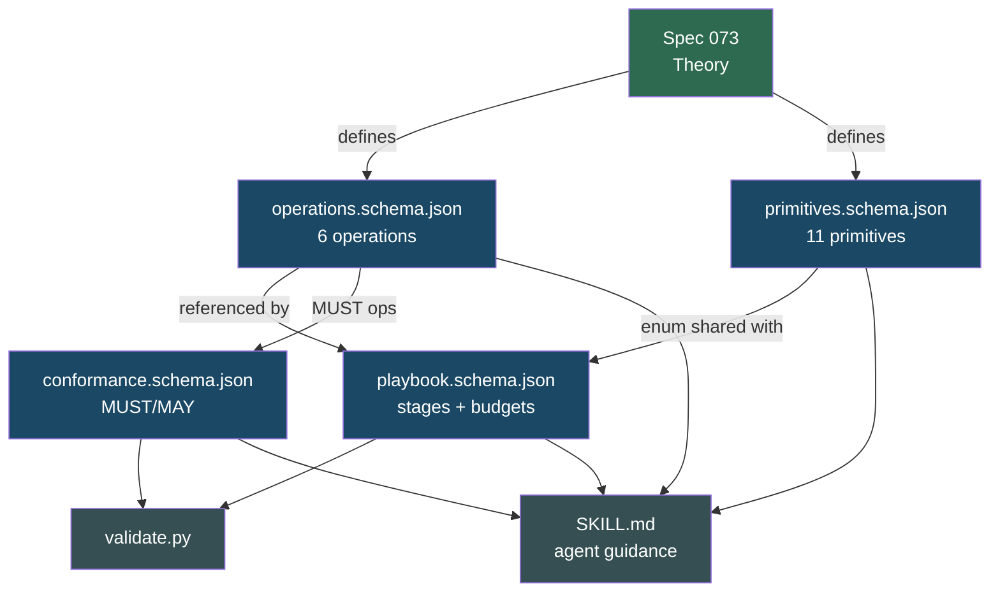

# Coordination Model Design — JSON Schema Definitions & Agent Skill

## Overview

Translates the abstract model (spec 073) into machine-validatable JSON Schema artifacts and a distributable Agent Skill. This is the "how it's specified" layer.

### Deliverable: Agent Skill

```
skill/coordination-model/
├── SKILL.md                                  # Agent guidance with quick reference
├── references/
│   ├── operations.schema.json                # 6 abstract operations
│   ├── primitives.schema.json                # 11 primitive config surfaces
│   ├── playbook.schema.json                  # Declarative composition format
│   └── conformance.schema.json               # Runtime capability declaration
└── scripts/
    └── validate.py                           # Schema + anti-pattern validator
```

All schemas follow JSON Schema Draft 2020-12. The `$id` fields point to `https://coordination-model.clawden.dev/schemas/` for future URL-based resolution.



## Design

### operations.schema.json
Defines the 6 operations with typed input/output signatures. Each operation has `name`, `input` (typed params), and `output` (typed return).

### primitives.schema.json
Defines 11 primitive configuration surfaces with `additionalProperties: false`. Each primitive has required fields, enums, and constraints specific to its coordination strategy.

### playbook.schema.json
Declarative composition format: stages referencing primitives, per-stage budgets (`max_agents`, `max_cost`, `max_time`), trigger/lifecycle modes, and composition rules. Includes anti-pattern constants for validator warnings.

### conformance.schema.json
Runtime capability declaration: 7 MUST booleans (6 operations + dynamic lifecycle, state observability, budget enforcement, composable patterns, trace capture, declarative playbooks) and 3 MAY booleans (distributed execution, persistent state, hot-swap patterns).

### SKILL.md
Agent-facing guidance: quick reference tables, playbook writing examples, conformance declaration format, validation instructions.

### validate.py
Python script that validates YAML/JSON files against the schemas, checks budget blocks, verifies primitive enums, and detects anti-pattern compositions.

## Plan

- [x] Author `operations.schema.json` — 6 operations with typed signatures
- [x] Author `primitives.schema.json` — 11 primitive configs with `additionalProperties: false`
- [x] Author `playbook.schema.json` — stage/budget/composition structure + anti-pattern const
- [x] Author `conformance.schema.json` — MUST/MAY capability booleans
- [x] Write `validate.py` — schema validation + anti-pattern checking
- [x] Write `SKILL.md` — agent guidance with quick reference tables

## Test

- [ ] Each schema is valid JSON Schema Draft 2020-12 (parseable by any compliant validator)
- [ ] `validate.py` loads all 4 schemas without error
- [ ] SKILL.md primitive table matches `primitives.schema.json` enum exactly
- [ ] All `$id` URLs follow consistent naming convention